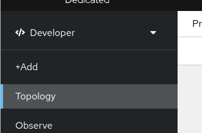
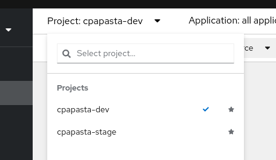
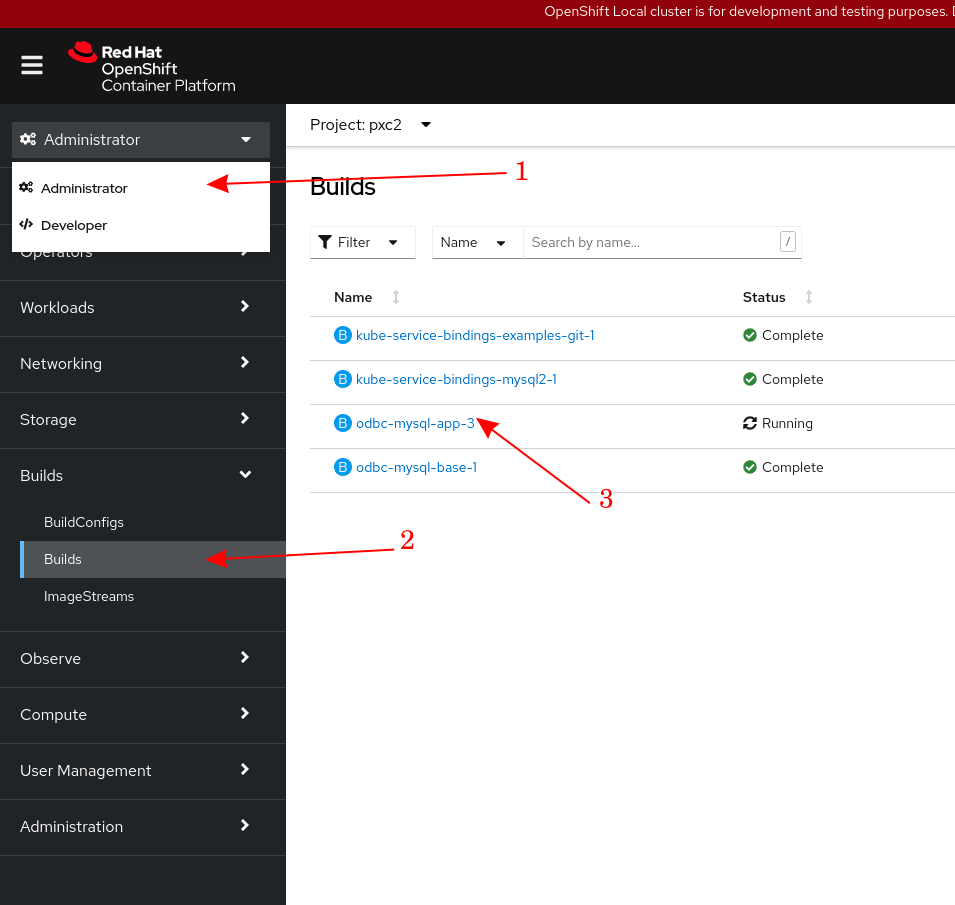
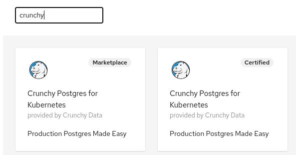
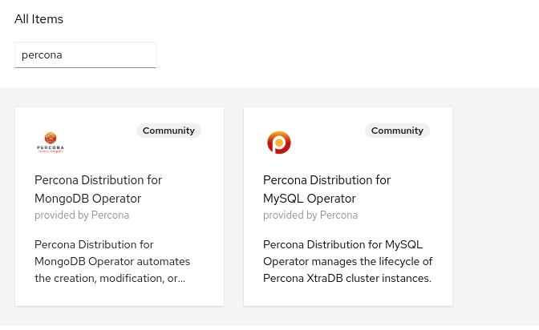
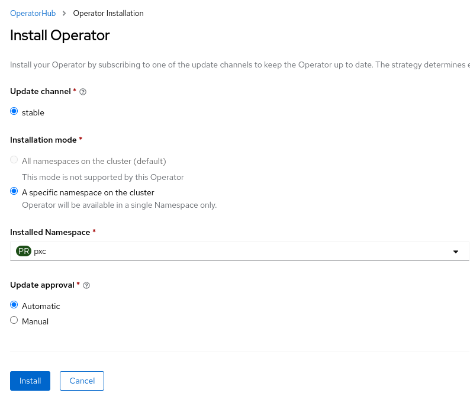
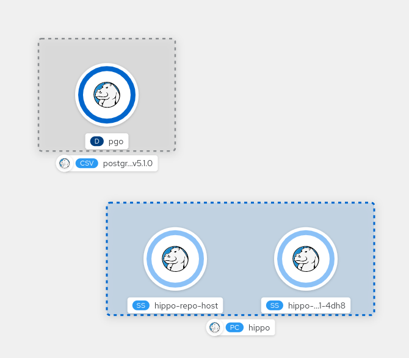
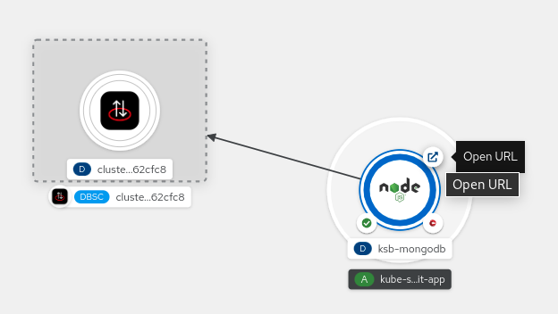
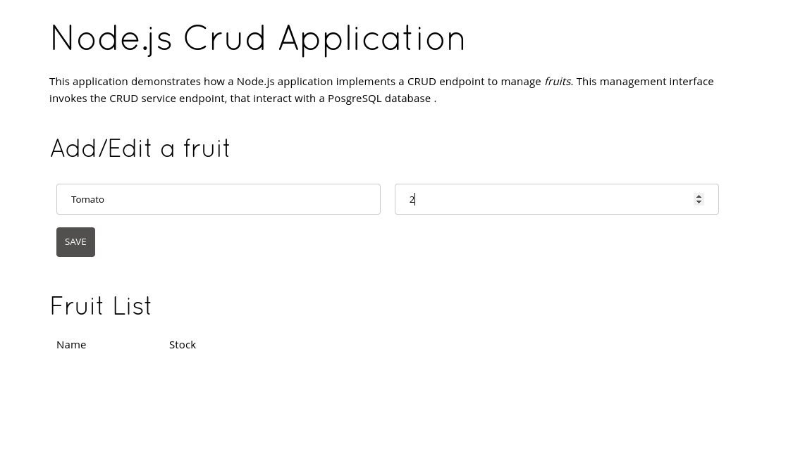
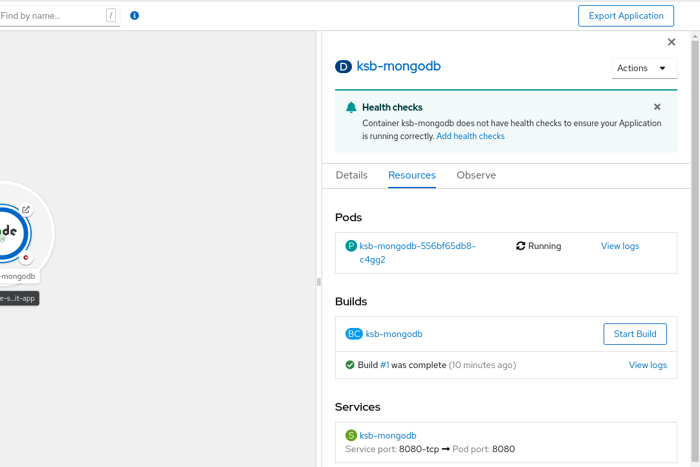

# kube-service-bindings

A repository with examples and links to examples utilizing the [kube-service-bindings](https://www.npmjs.com/package/kube-service-bindings) npm package:

- KAFKA
  - [node-rdkafka](https://github.com/nodeshift-starters/reactive-example/tree/node-rdkafka)
  - [kafkajs](https://github.com/nodeshift-starters/reactive-example)
- POSTGRESQL
  - [pg](./src/pg/README.md)
  - [odbc](./src/odbc-psql/README.md)
- REDIS
  - redis
  - ioredis
- MONGODB
  - [mongoose](./src/mongoose/README.md)
  - [mongodb](./src/mongodb/README.md)
- AMQP
  - [rhea](./src/rhea/README.md)
- MYSQL
  - [mysql2](./src/mysql2/README.md)
  - [odbc](./src/odbc-mysql/README.md)
  - [mysql](./src/mysql/README.md)

# Common Instructions

The examples listed need some common configuration along with some additional components needed by the example itself. In terms of common configuration they all need an OpenShift cluster and the service binding operator installed. As an example of additional components, the example showing how to use MYSQL with kube-service-bindings needs a MYSQL database installed.

This section explains how to install those common and additional components. The README.md for each of the examples within this repo (not the external examples) references these instructions and tell you specifically what you need to install and in what order.

## Select namespace/project

1. Select Developer mode (upper left)

   

1. Click on the topology button, located on the left sidebar.

   

1. Expand the `Project` dropdown menu (upper left on the UI) and select the project you would like to work on.

   

## Setup an OpenShift cluster on a Red Hat sandbox

Developer Sandbox hosted on the cloud provided for free by Red Hat, is a quick and easy way that requires zero setup with just a few clicks required only in creating a Red Hat account.

Steps for creating an OpenShift Cluster:

1. Visit https://developers.redhat.com/developer-sandbox/get-started
1. Click on Launch your Developer Sandbox for Red Hat OpenShift
1. Register for a Red Hat Account
1. After completing your registration, you get redirected to the initial page. Click on “Launch your Developer Sandbox for Red Hat Openshift”
1. Log in with your previously created Red Hat account
1. Fill the form with your personal information and click submit
1. Confirm your mobile phone number via text (don't forget to click on the Send Code button after filling your phone number)
1. Click on the “Start using your sandbox” button and your sandbox will start immediately!

More information about the Developer Sandbox on its resources and pre-installed software is available [here](https://developers.redhat.com/developer-sandbox).

## Setup an OpenShift cluster locally on your pc.

Visit below URL and click on Install `OpenShift on your laptop` button to start the installation guide:

- https://developers.redhat.com/products/openshift-local/overview

As described in the above guide, in order to install the OpenShift locally you have to download Openshift and add it to your PATH environment.

## Install OpenShift CLI (OC)

You can find instructions on how to install OpenShift CLI on below url:

- https://docs.openshift.com/container-platform/latest/openshift_cli/getting-started-cli.html

## Login to OpenShift with CLI

Visit OpenShift cluster and in upper right corner, click to expand your username. A dropdown will appear and by clicking on Copy login command you will be transferred to another page -> Display Token, copy the command looking similar to the below one and execute it on your terminal.

```
oc login --token=sha256~aaaaaaaa-aaaaaaaaaaaaaaaaaaaaaaaaaaaaaaaaaaa --server=https://your.oc.instance.url:6443
```

## Watch build progress of build config

1. Switch to Administrator view
1. Upper left sidebar
1. Click on Builds dropdown menu -> Builds
1. By clicking on the build that is in running state, you are able to see the logs of the build.



## Install Service Binding Operator

1. Select Administrator mode upper left

   

1. On operators click on operator hub

   

1. Search on the searchbox for binding and select the `Service Binding Operator`. Click on it and the click install

   

1. Select to install in on all namespaces

   

## Install Crunchy DB Operator

1. Create a namespace called postgres-operator

   ```
   oc create namespace postgres-operator
   ```

1. Select Administrator mode upper left

   

1. On operators click on operator hub

   

1. Search on the searchbox for crunchy and select the `Crunchy Postgres for Kubernetes` the Certified one. click on it and then click install

   

1. Select to install it on a specific namespace and on the dropdown select the namespace we previously created `postgres-operator`

   

## Install Percona Distribution for MySQL Operator

1. Select Administrator mode upper left

   

1. On operators click on operator hub

   

1. Search on the searchbox for "percona" and select the `Percona Distribution for MySQL Operator`. click on it and then click install

   

1. Select to install it on a specific namespace and on the dropdown select the namespace we previously created `pxc`

   

## Deploy MySQL - Percona XtraDB Cluster in Openshift

Hit below commands on your command line.

These commands are from [this](https://www.percona.com/doc/kubernetes-operator-for-pxc/kubernetes.html) tutorial and in case of something has changed, please visit the tutorial where the below commands are copied from.

```
git clone -b v1.11.0 https://github.com/percona/percona-xtradb-cluster-operator
cd percona-xtradb-cluster-operator
oc apply -f deploy/crd.yaml
oc create namespace pxc
oc config set-context $(kubectl config current-context) --namespace=pxc
oc apply -f deploy/rbac.yaml
oc apply -f deploy/operator.yaml
oc create -f deploy/secrets.yaml
oc apply -f deploy/cr-minimal.yaml
```

## Deploy PostgreSQL - Crunchy DB in Openshift

Below steps are from this [tutorial](https://access.crunchydata.com/documentation/postgres-operator/5.1.0/tutorial/), so in case of something has changed on below steps visit the above tutorial

1. clone repo with crunchy DB examples

```
git clone https://github.com/CrunchyData/postgres-operator-examples.git

```

2. Create a postgres cluster

```
cd postgres-operator-examples
oc apply -k kustomize/postgres
```

By visiting developer mode on topology, you should be able to see the postgres cluster being deployed



## Install Nodeshift

1. Install globally Nodeshift npm package

   ```
   npm install -g nodeshift
   ```

1. login with Nodeshift to Openshift

   ```
   nodeshift login --token=sha256~aaaaaaaa-aaaaaaaaaaaaaaaaaaaaaaaaaaaaaaaaaaa --server=https://your.oc.instance.url:6443
   ```

## Deploy Node.js app from OpenShift UI

1. Switch to developer mode
1. Select +Add from the sidebar menu
1. Click on Import from Git
1. On Git Repo URL set `https://github.com/nodeshift/kube-service-bindings-examples.git`
1. Click on show advanced Git options -> Context Dir set `/src/<app-folder>` -> Create

## Connecting Node.js app using service binding operator

Simply by dragging a line between the deployed app and the additional component used by the example (for example DB cluster) you should be able to share credentials between those two. The image below shows this action between a Node.js app and a database:


## Interact with the Application

By clicking on the boxed-arrow icon as shown on the immage below you can visit the UI of the app.



On the UI you are able to add, edit, fetch and remove all fruits from the database on the fruits collection.



## Viewing logs of the app

To View the logs of the app, Visit topology, click on the deployed application and on the right sidebar, on the pods section click on view logs, as shown on the image below.



For CRUD action on the fruits on the UI, the log will appear on the server.

## Node.js Applications folder structure

All the examples listed on this repository except the rhea one, are following the same folder structure as shown below.

```
├── controllers
│   └── fruits.js
├── handlers
│   └── index.js
├── lib
│   ├── db
│   │   └── index.js
│   └── queries
│       └── fruits.js
├── package.json
├── package-lock.json
├── public
│   ├── index.html
│   └── index.js
├── README.md
└── server.js

```

- **/controllers** : For each entity, we have the corresponding controller. Each controller is responsible for fetching the requested data from the Database. In our examples, we have only the Fruit entity, but we can easily add more entities by creating another controller, under the "controllers" directory. Across the examples, the controller code is the same. We succeed that by using the module exported by the /lib/queries/fruits file.

- **/lib/queries**: For each entity, we have the corresponding file under the /lib/queries directory. In our case, we have only one, the fruit.js.
  The controller uses the corresponding file for the entity that wants to serve, which contains the custom logic for fetching the data from the database. Before each query, we have to establish a connection to the database or validate that the connection is still open otherwise the query fails, for this purpose we use the /lib/db.

- **/lib/db**: For establishing a connection with the database we utilize the `init` module exported by the /lib/db/index.js file. The purpose of this module is:

  - To establish a connection with the database by using **kube-service-bindings** npm package
  - Seed the database
  - Provide a connection object, named either query or getDB.

* **/handlers**: In our examples, handlers are responsible for handling the requests that the controller is not responsible for, such as the /ready, /path, 404 errors etc.

Below Diagram depicts the sequence between the components after an HTTP request arrives on the server.

```mermaid
sequenceDiagram
   Client ->> /controllers: HTTP Request
   /controllers ->>/queries: execute
   /queries ->> /lib/dib:  execute
   /lib/dib ->> Database:  execute
   Database ->> /lib/dib:  result
   /lib/dib ->> /queries: result
   /queries ->> /controllers:  result
   /controllers ->> Client: HTTP Request
```
