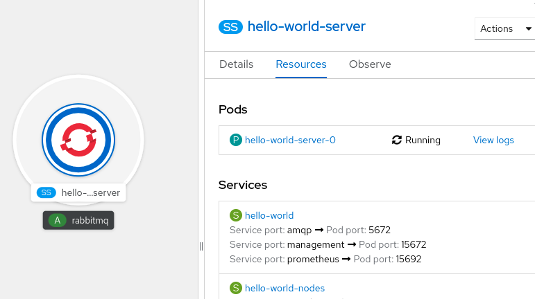
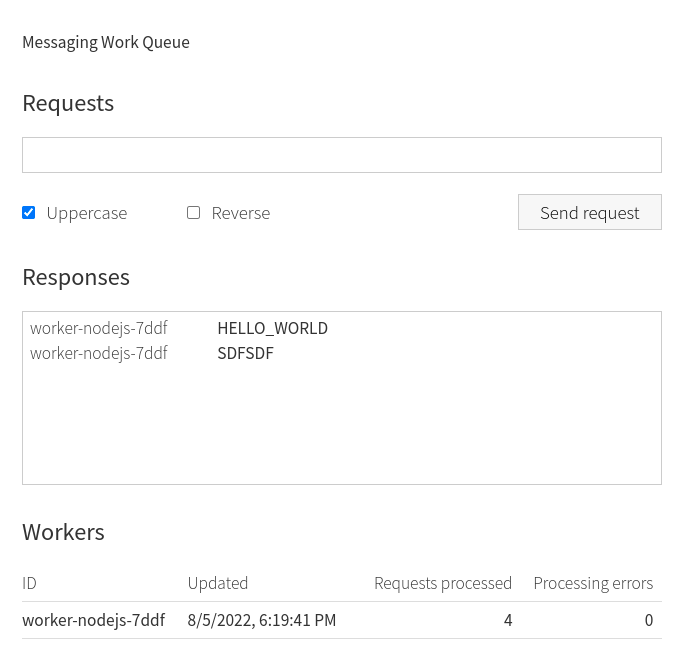

# AMQP1.0 on RabbitMQ- rhea client

## Prerequisites

- [OpenShift Cluster on SandBox](/README.md#setup-an-openshift-cluster-on-a-red-hat-sandbox) or [OpenShift Cluster locally on your PC](/README.md#setup-an-openshift-cluster-locally-on-your-pc)
<!-- - [Login to OpenShift with CLI](/README.md#login-to-openshift-with-cli) -->

- [Login to OpenShift with CLI](/README.md#login-to-openshift-with-cli)

## Install Service Binding Operator

**\*_NOTE:_** In case of **OpenShift cluster Sandbox**, Service binding Operator is already installed so you can skip this step.

- [Instructions](../../README.md#install-service-binding-operator)

## Deploy RabbitMQ on OpenShift

Let's create a namespace where the whole setup will be hosted.

```
oc create namespace rhea-example
```

After creating the namespace, the next step is to deploy RabbitMQ. Below commands are from this tutorial: https://github.com/rabbitmq/cluster-operator

```
oc apply -f https://github.com/rabbitmq/cluster-operator/releases/latest/download/cluster-operator.yml

oc apply -f https://raw.githubusercontent.com/rabbitmq/cluster-operator/main/docs/examples/hello-world/rabbitmq.yaml

oc adm policy add-scc-to-user privileged -z hello-world-server -n rhea-example

```

At this point, on topology view, a pod called hello-world-server should be up and running.

## Configure RabbitMQ to use amqp1.0 protocol

At this point, RabbitMQ is fully functional but does not support the amqp1.0 protocol. To enable it follow below steps as is from the below URL

Configuration Reference:

- https://www.rabbitmq.com/plugins.html

1. Click on the pod -> left sidebar -> Resources -> View logs as shown on the image below.
   
1. Click on the terminal tab and set the below command

   ```
   rabbitmq-plugins enable rabbitmq_amqp1_0
   ```

   That's it! RabbitMQ is ready to accept AMQP1.0 connections.

## Option 1: Deploy Node.js app with Nodeshift

1. [Install and Login with Nodeshift to Openshift](../../README.md#install-nodeshift)
1. Clone Node.js app repository

   ```
   git clone https://github.com/nodeshift-starters/nodejs-messaging-work-queue.git
   ```

1. Navigate to worker app source code

   ```
   cd nodejs-messaging-work-queue/worker
   ```

1. Deploy with Nodeshift

   ```
   nodeshift --namespace.name=rhea-example --expose
   ```

1. Navigate to frontend app source code

   ```
   cd nodejs-messaging-work-queue/frontend
   ```

1. Deploy with Nodeshift
   ```
   nodeshift --namespace.name=rhea-example --expose
   ```

## Option 2: Deploy Node.js App through the OpenShift UI

1. Switch to developer mode
1. Select +Add from the left sidebar menu
1. Click on Import from Git
1. On Git Repo URL set `https://github.com/nodeshift-starters/nodejs-messaging-work-queue.git`
1. Click on show advanced Git options -> Context Dir set `/worker` -> Create
1. Select +Add from the left sidebar menu
1. Click on Import from Git
1. On Git Repo URL set `https://github.com/nodeshift-starters/nodejs-messaging-work-queue.git`
1. Click on show advanced Git options -> Context Dir set `/frontend` -> Create

## Connect Node.js app with rhea - Binding

At this point, you should have frontend, worker and rabbitmq pods deployed as shown in the image below.


Next step is to exchange credentials between the rabbitmq and the pods for establishing a connection. We will do that by creating a service binding. That way kube-service-bindings will be able to consume the credentials and feed them to rhea client.
Unfortunately creating service binding is not yet supported by the topology UI by dragging a line in this specific case. Instead, we will use the CLI to apply the yaml files.

```
oc apply -f frontend-service-binding.yaml
```

```
oc apply -f worker-service-binding.yaml
```

## Interacting with the Application

By clicking on the boxed-arrow icon of the frontend pod, you will be redirected to the UI of the frontend app for adding items to the message queue.

